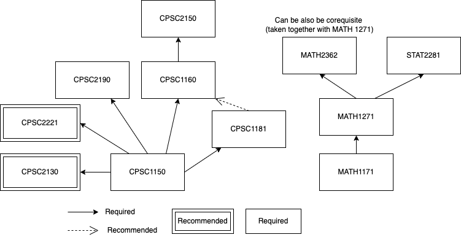

---
title: "Langara CS to SFU CS/ SoSy Transfer Guide"
date: 2022-06-27T14:54:10-07:00
draft: false
categories: ["guide"]
---
Last Updated: 28 June 2022
## Introduction
Hello! My name is Brian. I have just transferred to Simon Fraser University's Software Systems program this summer after graduating from Langara with an Associate in Computer Science.

In this guide, I will show you all the knowledge that I have accumulated to successfully transfer to Simon Fraser University (CS/ SoSy). You can also check out [this guide](https://www.reddit.com/r/langara/comments/ufzqc0/guide_for_cs_students_planning_to_transfer_to_ubc/) for the UBC version.

My guide here is mainly intended for Langara College students aiming to transfer to SFU. Though the general advice may still apply if you are from other colleges :).

Disclaimer: transfer requirements may change at any point in time. It is best to verify the requirements on the university's website and check with advising. I will not be responsible for any misinformation caused if, by any chance, some parts of this guide are not up-to-date anymore. Though if you find one, I will heavily appreciate it if you can contact me so I'll update the guide :).

## Applying to SFU
You need to use [EducationPlannerBC](https://educationplannerbc.ca/) to apply to SFU. You can go to the Apply section and sign up/log in with your EducationPlannerBC Account. 

If the application process has not been changed, you can choose up to 2 areas of the program to apply to. The first program is the one you want to get into and the second one is the backup program.

There are 2 possible strategies that I learned here:
- If you have a decent grade, you can choose both Software Systems and Computer Science in both of your options. This maximizes the chances for you to take computer science courses later.
- If you are not too sure whether you will get in, you can choose either Software Systems/ Computer Science as your first option and choose any program that is usually less competitive to get into. This maximizes the chance for you to get into SFU first.

Checking [Admission Averages](https://www.sfu.ca/students/admission/apply/admission-averages.html) is highly recommended. The difficulty may vary whether you are a domestic or international student. In the past, Software Systems has lower GPAs than Computer Science (but not always).

For the second option, if you got admitted to your second option. I would recommend to still continue taking courses at Langara if you still have less than 60 credits. Many people agreed that internal transfer (changing major) is harder than external transfer. Though if you are unsure, you can check simonfraser reddit and search around this topic.

## General Strategy
Depending on your confidence in your ability to get good GPAs, there are different ways to take your courses and when to transfer. I will describe it here below.

Ways to pick the courses:
1. **The Smart Way** - Focus on only taking the core requirements. This is best suited for those who are confident they can get the grade requirement to transfer. This strategy will benefit you later in the university where you will still have many rooms for electives.
2. **The Booster Way** - Take the core requirements and also several electives at Langara. This is best suited for those who are not sure whether they can achieve the required GPA. By carefully picking the courses that might potentially boost the GPA, the person using this strategy may have a higher chance to get into SFU.

From my experience,  MATH and ENGL are famous as a GPA downer. This also heavily depends a lot on the person's liking.

When to transfer:
1. **Associate Transfer**  - If you are transferring with an associate degree, you will receive a preference in admission by having a GPA of 0.25 points less than the regular transfer. [Source](https://www.bctransferguide.ca/learn-more-about/associate-degrees/transfer/)
2. **Quick Transfer**  - Best suited for those who currently have a good average and/or those who want to get into the university as soon as possible. This is also good if you want to get into the coop program as soon as possible.
3. **Full Transfer**  - Transfers with a lot of credits but do not finish with an associate degree.

Choosing when to transfer also heavily determines how you will pick the courses. Usually, Associate transfer does not really let you choose which courses to take (unlike the 2 other ways). I end up taking all the required MATH and ENGL courses.

In general, more transferred credits will save you money while transferring quickly will allow you to get into the coop program quickly. There are no better ways of transferring as each has its own pros and cons.

I personally prefer to get the associate first to save cost. As of Sept 1, 2022, 1 SFU credit is $1,059.15 while 1 Langara credit is $625.40 (International student fees). I also get to enjoy the smaller class experience here.

## Admission Requirements
[SFU Admission Requirements](https://www.sfu.ca/students/admission/admission-requirements/transfer/college-university.html).

As this topic may change at any point in time, checking the website above is highly recommended.

Here are the requirements that you need to take as a college transfer student:
-   [English Language admission requirement](https://www.sfu.ca/students/admission/admission-requirements/english-language-requirement.html)
-   [Quantitative and Analytical skills requirement](https://www.sfu.ca/students/admission/admission-requirements/quantitative-skills-requirement.html)

Minimum 24 units of transferable coursework, including:

-   One Mathematics course from: 
	-   MACM 101 = LANG CPSC 2190 (Discrete Math)
	-   MATH 150 (or 151) = LANG MATH 1171 (Calculus 1)
	-   MATH 152 = LANG MATH 1271 (Calculus 2)
	-   MATH 240 (or 232) = LANG MATH 1252 (or 2362)
-   One Computing Science course from: 
	-   CMPT 125 (or 126, 128 or 135) = LANG CPSC 1181 (or 1155)
	-   CMPT 225 = LANG CPSC 2150
	-   CMPT 276 (or 275) = LANG CPSC 2350
-   One additional Mathematics or Computing science course chosen from the above lists.

## Langara Courses to Take
Useful websites to determine these courses:
- [BCTransferGuide](https://www.bctransferguide.ca/search)
- [SFU CS Fall 2022](http://www.sfu.ca/students/calendar/2022/fall/programs/computing-science/major/bachelor-of-science-or-bachelor-of-arts.html)
- [SFU SoSy Fall 2022](http://www.sfu.ca/students/calendar/2022/fall/programs/software-systems/major/bachelor-of-science.html)
- [Langara CS Associate](https://langara.ca/programs-and-courses/programs/computer-science/program-curriculum.html)

First and foremost, I highly emphasize the importance of choosing the right course and the right professor. It is quite common to see people picking the wrong course, thus ending up wasting a lot of time and money.

I define 3 types of courses that can be taken here:
1. Core  - Core for SFU CS/ SoSy graduation requirement. 
2. Recommended - Not core, but useful to take (either GPA booster or count towards SFU CS/ SoSy electives requirement).

### Core Courses
I mainly define core courses as courses that are part of the graduation requirement at SFU. Bare in mind that you do not need to take all core courses to transfer to SFU.
If you intend to transfer ASAP, taking CPSC 1150, 1181, Math 1171, and 1271 is sufficient.

**NOT ALL  CORE COURSES ARE RECOMMENDED**.

I won't recommend taking STAT 2281 unless you have no other choice.
I also won't recommend taking CPSC 2350 by any means since it has 6 credits as prerequisite (CPSC 1030 and CPSC 1045). Other core courses except these two should be fine to take.

<figure>
	
	<figcaption style="text-align: center;"> CPSC and MATH Course Prerequisite Diagram
	</figcaption>
</figure>

1. **CPSC 1150: Program Design (3) -> SFU CMPT 120 (3)**
	- Introduction to programming in Java. You will mainly learn about pseudocode, the basic syntax of Java (if/else, loop), and recursion (only tracing) in the last week.
	- Prerequisite for most computer science courses in Langara (CPSC 1181, CPSC 2190, CPSC 2221)
	- Alternatively, CPSC1155 is also available (Introduction in C++). It transfers to CMPT 120/128/130 but I heavily recommend just taking CPSC1150 as (1) Java is generally easier, (2) Java knowledge is required in CPSC 1181, and (3) you will learn enough C++ in CPSC1160 and CPSC 2150.
	- Taken online with Bita Shadgar, her style of teaching is not my favorite. However, she is kind and patient, and always asks if in doubt.
2. **CPSC 1181: Object-oriented Computing (3) -> SFU CMPT 125 (3)**
	- More programming in Java. You will mainly learn about Object-Oriented Programming (OOP). Some other topics like JavaFX, multithreading and networking may be included.
	- Taken online with Hossein Darbandi, he is the definition of work smart. All lectures are recorded and usually, he likes to take a tea break. Can be quite condescending at times, but he will answers the question regardless.
3. **CPSC 1160: Algorithms and Data Structures I -> SFU CMPT 1XX (3)**
	- Algo and DS in C++. You will learn a lot about recursion, linked lists, and trees.
	- I find CPSC 1160 to be harder than 1181. So, even though you can take 1160 after 1150, I highly recommend taking CPSC 1181 first. Taking CPSC1160 and CPSC1181 at the same term can drain your energy as you will need to do 2 coding assignments every week.
	- Required for CPSC 2150. Do not take this course if you don't intend to take CPSC 2150 as it transfers only to general credit.
	- Taken online with Muntaseer Salahuddin. He is one of the best CS lecturers in my time at Langara. Very passionate, funny, kind, and willing to answer your questions. His exam was the hardest for CS, but possibly because I took it online.
4. **CPSC 2150: Algorithms and Data Structures II -> SFU CMPT 225 (3)**
	- Second part of Algo and DS. CPSC 1160 topics are revisited. Will also learn about stacks, queues, heaps, and graph theory.
	- I spent a lot of time in this course. The assignment is heavy (but interesting). The most favorite part is that the exam is more on the doable side. Possibly because I took it offline.
	- Taken with Gladys Monagan. She is my favorite instructor at Langara. As long as you show some effort in doing the assignment and ask good questions, she is willing to go above and beyond to help you.
5. **CPSC 2190: Theoretical Foundations of Computer Science -> SFU MACM 101 (3)**
	- Discrete Math. Quite different compared to calculus and the likes. You will learn about proofing, counting, and many other things.
	- Some people hate it, and some like it. I am more on the latter part. This is my favorite math course as it reminds me of youtube riddles. Here is [one of the topics](https://en.wikipedia.org/wiki/Knights_and_Knaves) it covers.
	- Do a lot of suggested problems to familiarize yourself with the concepts. It may be given in the course outline, if it is there, do it! There is a high chance it will be included in quizzes or exams.
	- Taken with Mahdad Khatirinejad. My favorite math professor at Langara. He is really good at answering any questions you have and his lecture is really engaging. One thing I don't like with his delivery is that the quizzes are held at the end of class (some people prefer to study instead of listening to his lecture). Also, the minimum to get A+  is 96 (he scales though).
	- Other people that I know took this course with Haotian Pang. The assignment is worth more in his class and the minimum for A+ is 90.
6. **CPSC 2350: Software Practices -> SFU CMPT 276 (3)**
	- Core, but not recommended to take.
	- Learn about git and other software engineering tools.
	- Technically, it's a core but I didn't take it as it requires CPSC 1030 and 1045 as its prerequisites (CPSC 1030 and 1045 do not count for graduation).
	- Heavily recommended to just take this equivalent course later at SFU. CMPT 276 at SFU is famous for its hands-on group projects that will allow you to build interesting projects. I am taking CMPT 276 this summer and we are building a full-stack web application. The languages used may vary depending on the professor though (can be Java, JavaScript, Swift, and Ruby just to name some).
7. **MATH 1171: Calculus 1 -> SFU MATH 151 (3)**
	- Can be challenging for some people. Grind the suggested exercises and WebAssign to make sure you know the stuff.
	- Interestingly, I didn't take this course as I didn't have the prerequisite at that time. I took MATH 1175 instead.
	- Alternatively, you can take MATH 1173 (4). 1 more credit means $625.4 more expensive. Not really recommended unless you cannot take 1171 due to some reasons (MDT/ waitlist).
	- You can also choose to take MATH 1174 (business)/ MATH 1175 (life science). I don't recommend it as you need to get at least a B+ to make sure it is counted towards graduation in SFU.
	- Taken online with Pichmony Anhaouy. He is really caring and the exam is on the easy side personally. Lecture notes are really organized. Recommended.
8. **MATH 1271: Calculus 2 -> SFU MATH 152 (3)**
	- Same advice as MATH 1171. Grind the suggested exercises if you are worried you won't do good.
	- You can choose to also take MATH 1273/1274/1275. But I still won't recommend it due to reasons similar to calculus 1's.
	- Coming from MATH 1175, I find this course to be harder. A lot more concepts and formulas. Conceptually, I don't find it that hard for each section. However, you need to understand which tool needs to be used for which problem. That is what makes it challenging.
	- Taken online with Mahdad Khatirinejad. Really good :).
9. **MATH 2362: Linear Algebra -> SFU MATH 240 (3)**
	- Linear Algebra. Personally, I enjoy the content better than calculus. But unlike calculus, I don't get to learn its applications, making it feels useless as I don't know what I am going to use it for. However, this will be useful if you intend to learn computer graphics.
	- Don't forget to grind the suggested exercises!
	- While this course can be taken as a corequisite with Calculus 2, I heavily recommend against it as taking these two in the same term will cause your brain to burst. Take it only if you are confident with math or have a lighter workload overall.
	- Taken online with Pichmony Anhaouy. In the latter part of the courses, I kind of memorized the concepts for the final. Ended up getting a good grade but feels like I don't get the whole concept.
10. **STAT 2281: Probability and Elementary Mathematical Statistics -> SFU STAT 270 (3)**
	- Core, but not recommended to take at Langara.
	- All about discrete and continuous probabilities. Applications and proofs.
	- Hardest math/stat course so far personally. Unless you are transferring with an associate or have no other courses to take, I don't think you need to take this course at Langara. The grade that I got in this course is far below my other math courses. I have a friend in SFU taking STAT 270 and it was easier and covers a narrower topic.
	- Taken with Ken Li (Shuk Wong Li). He is a funny guy, but I don't find he was ready to teach this course. The assignment is almost always due on Sunday, My group of friends taking this basically had no weekend for the latter half of the term :)). I can see that he can be good at teaching the lower-level courses, but the concept in this course was just too hard to be taught and he makes a lot of calculation mistakes on the whiteboard. He might be better in the future though (I took it when it was his first time teaching this course). There was one time when he asks who finished the assignment and only one guy raised his hands up xD.

### Recommended Courses
I define recommended courses as courses that are not part of the core requirements of the CS/ SoSy major but definitely can be taken towards either SFU graduation requirements (upper-division CS, WQB requirement) and/or Langara graduation requirements.

1. **CPSC 1050: Introduction to Computer Science -> SFU CMPT 1XX (3)**
	- WARNING: does not count towards anything in SFU, just a general elective. I still listed this course because required for the associate degree.
	- Does not really transfer to CS course. However, this course gives a brief overview of what a CS degree looks like. The topic is quite similar to [Harvard CS50](https://www.google.com/search?q=harvard+cs50&oq=harvard+cs50&aqs=chrome..69i57.2447j0j1&sourceid=chrome&ie=UTF-8).
	- Has a lot of assignments. I don't find it to be that hard, but it is by no means a light course. If you are diligent, this course can be a good GPA booster.
	- Taken online with Alireza Osareh, his assignments have clear instructions. Even if unclear, you can always ask him to provide more clarity. Good!
2. **CPSC 2130: Multimedia and Animation -> SFU CMPT 365 (3)**
	- The most interesting CS courses (though not as useful) I have taken here. The topic is about image, audio, and video tools using JavaScript and technologies. We used Adobe Photoshop, Adobe Premiere Pro, and Adobe Audition in this course.
	- I got to make [3D Ping Pong](https://brianrahadi.github.io/3d-pingpong/) and [Bird Comet Escape](https://brianrahadi.github.io/bird-comet-escape/) in this course :D.
	- CMPT 365 is not really taken a lot in SFU, but taking here will help you to finish the upper-division CS requirement.
	- While this course is really interesting, it can be hard for those who have no experience of HTML/ CSS/ JS. I have exposure to these language, so it was really not a problem for me.
	- Taken with Anupama Gupta. She is really kind and understanding. Most of the lectures were recorded even though it is offline classes. I personally prefer it this way though.
3. **CPSC 2221: Data Base Systems -> SFU CMPT 354 (3)**
	-	Database is a really useful course. I believe most people in the CS program will also take this course, so it's better if you take it now.
	-	More focused on the database design and SQL queries. We don't really learn how to use the database, link it to the website, and deploy it to the cloud here.
	-	I find this to be one of the easier courses. It might also be because I took it in the last term after finishing most cs courses. Really interesting IMO.
	-	Taken with Saeed Mirjalili. Really engaging lecture and helpful. Not really accessible through email. Recommended to just ask him questions in person.
4. **APSC 1010: Engineering and Technology in Society and APSC 1050: Process, Form, and Convention in Professional Genres -> SFU ENSC 100 (3) B-Hum/Sci and SFU ENSC 105 (3)**
	- Combined as this course is a co-requisite. I would say this is useful if you intend to transfer to SoSy as ENSC 105 counts as the writing requirement. You can use ENSC 100 for the breadth requirement.
	- APSC 1050 is taken with Hannah Gustafson. Her online lecture is the best I have had so far as she really tries to make the class as engaging as possible. She also has a cute little baby. Highly recommended!
	- APSC 1010 is taken with Zahra Tayarani. I don't think she is teaching again. The lecture is a bit boring as she basically only reads out the slides.
5. **PSYC 1115: Introduction to Biological, Cognitive, and Developmental Psychology -> SFU PSYC 100 (3) B-Soc**
	- Counted as B-Soc for SFU WQB requirement.
	- This psychology course is more biology-like. I took this after taking PSYC 1215. Honestly, I prefer PSYC 1215 more as I find social psychology to be more interesting.
	- Not always a GPA booster in my opinion. Take it if you think you enjoy reading textbooks and are good at memorizing.
	- Taken online with Noushine Afshar. I don't really get to interact with her as it was online and every lecture is recorded. PSYC 1115 and 1215 are mostly just self-learning through the launchpad. The course has 3 exams (the last one is cumulative).
6. **PSYC 1215: Introduction to Social, Personality, and Abnormal Psychology -> SFU PSYC 102 (3) B-Soc**
	- Counted as B-Soc for SFU WQB requirement.
	- Not always a GPA booster in my opinion. Take it if you think you enjoy reading textbooks and are good at memorizing.
	- Social Psychology. Arguably the most interesting course I have taken outside my major. I find some concepts here that really make sense and I like to apply them in my daily life (ex. bystander effect, spotlight effect, confirmation bias, discrimination)
	- Taken online with Laura Adams. Really enjoyable lecture with her.
7. **CPSC 1030: Web Development I or CPSC 1045: Introduction to Web Programming -> SFU CMPT 165 (3) BOTH**
	- Not counted at all for SFU graduation requirement nor Langara associate requirement. You can still count them as general elective though.
	- Labelled as B-Sci, but this is a CPSC course. It will not be counted towards breadth for CS/ SoSy Major.
	- If your GPA is slightly below 3.7, I heavily recommend taking this course to get that sweet transfer scholarship (you can see details in the general tips section below).
	- Have not taken either these two courses, but I have taught these courses as a teaching assistant. Personally, I found CPSC 1030 to be the easiest. CPSC 1045 should be slightly easier or equal to CPSC 1150 in terms of difficulty. The difficulty of these two courses may also depend on your instructor .

My recommended courses are just courses that I have experience with. I won't recommend PSYC1115 and PSYC1215 blindly to everyone as there are also different courses you can take (see SFU WQB Requirements below).

###  SFU WQB Requirements
[SFU WQB Link](https://www.sfu.ca/ugcr/for_students/wqb_requirements.html)

Below, I am copy-pasting the information from SFU.

In SFU, every undergraduate student needs to take a minimum of 36 credits of courses designated as Writing, Quantitative, or Breadth, with a grade of C- or better to receive WQB credits.

Writing Requirements: 
- one lower-division W course (CMPT105W for CS, SoSy has much more choices)
- one upper-division W course (CfMPT376W for both CS and SoSy, must be taken at SFU)

Quantitative Requirements:
- two Q courses (we don't really need to care about this as CS majors already have a lot of quantitative courses)

Breadth Requirements:
-   two B-Hum courses (I took ENGL 1130 and APSC 1010 for this)
-   two B-Sci courses. (I took BIOL 1115 and CPSC 2190 for this)
	-   MACM 101 (CPSC 2190) already counted for one B-Sci
-   two B-Soc courses (I took PSYC 1115 and 1215 for this)
-   two undesignated Breadth (6 units) (Any courses outside the major should qualify, my SFU shows it is ENGL 1123 and APSC 1050 for this)

Important to Remember: Breadth Courses are courses that is outside your major. So, any CPSC course with Breadth label will not be counted.

To make sure that we still have the same requirements, I recommend going to [SFU CS form website](http://www.sfu.ca/computing/current-students/undergraduate-students/forms.html) and check the graduation planner. I used Computing Science Major - Fall 2021 and Software Systems Major for this. It still have the same requirements up until the time of written.

There are many options to fulfill your courses for the SFU WQB requirement. You can check [SFU designated breadth course](https://www.sfu.ca/ugcr/for_faculty/certified_wqb_courses/certified_designated_breadth_courses.html) and BCTransferGuide for the available courses.

Generally, you do not need to finish all the WQB requirements at Langara. However, if you plan to take some electives before transferring, it is best to take the ones that are also counted as SFU Breadth courses.

### Graduating with an Associate Degree
As an international student, an associate degree allows you to get a [post-graduation work permit](https://www.canada.ca/en/immigration-refugees-citizenship/services/study-canada/work/after-graduation/eligibility.html). This is really useful in case you may prefer to work first instead of transferring to university right away. Also, it will allow you to get preference in university admission (SFU only).

[Associate Degree Link](https://langara.ca/programs-and-courses/programs/computer-science/program-curriculum.html)

Course planning can be quite challenging as you need to make sure that the course counts for both Langara Associate and SFU Graduation Requirements. Make sure to check the BCTransferGuide, SFU website, and Langara Associate Degree website.

Courses I took:
- Core courses: CPSC 1050, 1160, 1181, 2150, MATH 2362, CPSC 1150, MATH 1175, MATH 1271
- Second-year CPSC courses: CPSC 2130 and CPSC 2221
- Two ENGL courses: ENGL 1123 and 1130
- Two university-transferable arts: PSYC 1115 and 1215
- Two second-year science courses: STAT 1181 and STAT 2281
- Four university-transferable electives (at least 1 lab science): CPSC 2190, APSC 1010, APSC 1050, BIOL 1115

[Langara website to determine course attributes](https://langara.ca/programs-and-courses/courses/course-attributes.html)

To check whether a course is university-transferable or not, you can go to the website above and check if there is a 'Y' in the UT attribute. Better way, you can go to BCTransferGuide to check if this course is transferred to at least one University (This is told by Advising).

Checking whether a course is an arts course is a bit harder, I have confirmed this on advising on November of 2020. While I don't think this have not changed at all, you can confirm this on advising again. This is what the advising person said:

> "Arts electives are typically non-Science/Math and non-Business courses. You’re correct, we do not have an attribute for first-year Arts courses, however you can choose from the [Arts and Humanities & Social Sciences categories](https://langara.ca/programs-and-courses/courses/index.html) in our Course Index when choosing Arts courses." - Langara Counselling

Last but not least, if you are planning to take a lab science course. I suggest taking 3-credit lab science courses. Again, you can check Langara course attribute that fulfills the "LSC" requirement.

### Math Diagnostic Test (MDT)
To be able to enroll into MATH 1171, you need to get at least 95 in MDT. 95 is the code, not the actual score. I heavily recommend studying for this test. Lower code may only allow you to take MATH 1173/ 1174/ 1175. I don't recommend taking either of these three for reasons I have stated above.

### Langara English Test (LET)
To be able to enroll into ENGL 1123/1129/1130, you need to get at least LET 3.

I didn't take LET because it was online and I thought I may transfer earlier. I ended up taking ENGL 1107, which is quite a huge waste of money.

If you intend to transfer to SFU, you can still transfer by not taking any ENGL courses. You can find any courses in BCTransferGuide that is has certified W label.

I generally recommend taking ENGL courses if you want to finish the associate degree. If you don't want to get the associate, ENGL course usually takes lesser time commitment but harder to get good grades. You can take ENGL1123 for the W or ENGL1129/1130 for the B-Hum though.

## FAQ
1. Why Software Systems over Computer Science? What is the difference?

First off, I will start by saying I don't think there is much difference between these two. Software Systems are just a subset of Computer Science. You still can be a CS major and take the same courses as the SoSy major. You can take a look at [this Reddit post](https://www.reddit.com/r/simonfraser/comments/bmt2zc/software_systems_program_bsc_masterpost/).

Personally, other reasons I chose SoSy over CS are:
- SoSy gets priority enrollment in Surrey CS courses (they still have the same priority as CS students in Burnaby).
- I will not need to take CMPT105W and MACM316. Honestly, I am okay taking if I need to take these two courses. But if I have to choose between taking these or the sweet upper-division CS courses, I would definitely choose the latter :).

As of Fall 2022, SFU CS also has a [concentration that you can take](https://www.sfu.ca/computing/current-students/undergraduate-students/programs/computing-science-major1.html).

2. Why SFU over UBC?

This is the question I had been wondering the most when I was at Langara. I never got a solid answer only until Spring 2022.

I don't think there are clear answers for everyone and the answer definitely varies from person to person. Keep in mind that these are the answers that I answered for myself.

**SFU Pros:**
- SFU offers more practical CS courses. In general, CS courses at SFU are more applied. By taking a look at SFU SoSy, there are more interesting CS courses to be found (ex. Web Architecture, Client-side WebDev, Server-side WebDev, Software Development Methods, Software Testing).
- SFU is cheaper. As an international student, I saved at least CAD 20,000 by choosing SFU over UBC.
- I don't need to take more lab sciences at UBC. UBC requirement is more strict. I would need to take physics and chemistry course to fulfill the science breadth requirement.
- Computer Science is merit-based. Compared to other majors, the university you go to does not matter as much. After several years in the industry, you will be assessed more based on your industry experience, not which university you went to.

However, I don't want to be biased. So I also want to list several reasons why UBC might be better.

**UBC Pros:**
- Prestige. The brand of the university also matters more if you were to work outside Canada.
- Environment. As UBC is just ranked higher, there are generally smarter students that thrive there. However, My take is that those who thrive are mostly not really because of the education, but because of what they achieve on their own (clubs, projects).

At the end of the day, your answer will ultimately depends on what you think is more important for you :). Both university have strong coop programs. As long as you have a strong drive to learn, you will definitely succeed in any of these two.

## General Tips
- SFU offers admission 3 times a year (Spring, Summer, and Fall).
- Plan your course carefully. A few hours of course planning can save you a lot of time and money.
- If you have GPA above 3.7, you may get [a $3500 entrance scholarship at SFU](https://www.sfu.ca/students/financialaid/entrance/regulations/transfer-scholarships.html). This is really helpful!
- Taking 3 courses and passing all of them is far better than taking 5 courses but ending up failing one of them.
- Unless you enjoy math, try to not have more than 1 math course at one term. I would define math courses as any math/ stat course and CPSC 2190. Personally, I perform better on math course where I can finish the given suggested exercises. I don't think I can mentally handle taking two math courses while also finishing all their suggested exercises.
- Same rule applies to heavy coding course. When you are starting out at college, it can be hard to differentiate the syntax between each programming language. It may end up making you confused on the exams if you are taking two at the same time. Not all CPSC courses are heavy coding course. I would define heavy coding course as one of the following: CPSC 1045, 1150, 1155, 1160, 1181, 2130, 2150. 

## General Study Tips
- Always go to your office during hours if needed. Langara's biggest advantage is the empty office hours. There are times when my CS instructor was able to go above and beyond to help me solve my assignments.
- Find a study buddy (if you don't have one). While I learn better alone, there will always be the time when I just don't know how to answer some questions. Even if you are the smarter one, teaching will also help you to understand the concepts better. Read the Feynman Technique for more.

## Courses I Have Taken
**Fall 2020**
1. APSC 1010 - Engineering and Technology in Society
2. APSC 1050 - Process, Form, and Convention in Professional Genres
3. MATH 1175 - Calculus I with Applications to Life Sciences

**Spring 2021**
1. MATH 1271 - Calculus II
2. CPSC 1050 - Introduction to Computer Science
3. CPSC 1150 - Program Design
4. STAT 1181 - Descriptive and Elementary Inferential Statistics
5. BIOL 1115 - General Biology I

**Summer 2021**
1. PSYC 1215 - Introduction to Social, Personality, and Abnormal Psychology
2. CPSC 1160 - Algorithms and Data Structures I
3. CPSC 1181 - Object-oriented Computing
4. ENGL 1107 - Language and Composition I
5. MATH 2362 - Linear Algebra

**Fall 2021**
1. CPSC 2150 - Algorithms and Data Structures II
2. CPSC 2190 - Theoretical Foundations of Computer Science
3. ENGL 1123 - Introduction to Academic Writing
4. PSYC 1115 - Introduction to Biological, Cognitive, and Developmental Psychology

**Spring 2022**
1. CPSC 2130 - Multimedia and Animation
2. CPSC 2221 - Database Systems
3. STAT 2281 - Probability and Elementary Mathematical Statistics
4. ENGL 1130  - Modern Novel, Poetry, and Movie

Overall, I am pleased with the courses I have taken. Courses that are not really useful for SFU graduation requirement are STAT 1181 and ENGL 1107. I also won't recommend BIOL 1115 as it is a 4-credit course. It has 3 lab exams, 2 midterms, and a final. Quite stressful for 1 course.

If I have to start all over again at Langara, I would definitely take roughly the same courses. The one that I would change is only BIOL 1115 to any 3-credit lab science course. I basically burnt 1 credit worth of a course as I have 61 transfer credits.

## Useful Links
As there are so many links throughout this guide, I have listed again all the helpful transfer-related links below

Official Website
- BCTransferGuide - https://www.bctransferguide.ca/search
- BCTransferGuide Associate Degree Info - https://www.bctransferguide.ca/learn-more-about/associate-degrees/transfer/
- EducationPlannerBC -  https://educationplannerbc.ca/
- Canada PGWP - https://www.canada.ca/en/immigration-refugees-citizenship/services/study-canada/work/after-graduation/eligibility.html

Langara Websites
- Langara Associate in CS - https://langara.ca/programs-and-courses/programs/computer-science/program-curriculum.html
- Langara Course Attributes - https://langara.ca/programs-and-courses/courses/course-attributes.html

SFU Websites
- SFU Admission Averages - https://www.sfu.ca/students/admission/apply/admission-averages.html
- SFU Admission Requirements - https://www.sfu.ca/students/admission/admission-requirements/transfer/college-university.html
- SFU CS Fall 2022 - http://www.sfu.ca/students/calendar/2022/fall/programs/computing-science/major/bachelor-of-science-or-bachelor-of-arts.html
- SFU SoSy Fall 2022 - http://www.sfu.ca/students/calendar/2022/fall/programs/software-systems/major/bachelor-of-science.html
- SFU WQB Requirements -  https://www.sfu.ca/ugcr/for_students/wqb_requirements.html
- SFU CS Concentrations - https://www.sfu.ca/computing/current-students/undergraduate-students/programs/computing-science-major1.html
- SFU Transfer Scholarships - https://www.sfu.ca/students/financialaid/entrance/regulations/transfer-scholarships.html
- SFU Designated Breadth Course - https://www.sfu.ca/ugcr/for_faculty/certified_wqb_courses/certified_designated_breadth_courses.html
- SFU CS Form Website - http://www.sfu.ca/computing/current-students/undergraduate-students/forms.html

Reddit Posts
- Langara to UBC CS Reddit - https://www.reddit.com/r/langara/comments/ufzqc0/guide_for_cs_students_planning_to_transfer_to_ubc/
- SFU SoSy Masterpost Reddit - https://www.reddit.com/r/simonfraser/comments/bmt2zc/software_systems_program_bsc_masterpost/

## Conclusion
Thank you so much for reading up until this point. I finally have made this guide after planning to make it for so long. The reasons I made this guide are mainly to make sure people avoid bad course and to save time and energy. I have an spent a lot of time planning my courses when I think it should not be that long.

In case you see any error in writing or have information to be added, feel free to reach me out.

